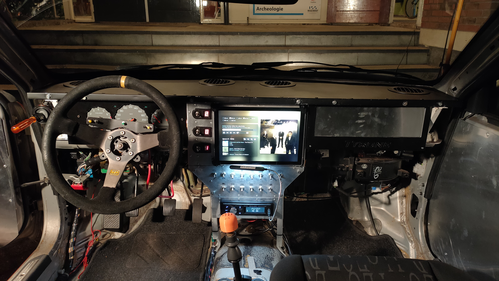

# Offline mode

The music player has an 'offline mode'. In this mode, the application:

- Does not make any connections to the internet.
- Does not transcode audio or images, always uses high quality opus audio and webp images. This means that Safari is not supported.
- Does not use a local music library, but synchronizes from a main music server.
- Keeps a local history, which it submits to the main music server when an internet connection is available.



## Installation

To install the music player in offline mode, follow the [standard installation instructions](./installation.md) with one change; add the command line flag `--offline` or environment variable `MUSIC_OFFLINE_MODE: 1`.

## Synchronization

To synchronize history and music, run:
```
python3 mp.py sync
```
or, if using docker:
```
docker compose run music sync
```

It is safe to abort synchronization using Ctrl+C. When restarted, it will resume where it left off.

Only favorite playlists will be downloaded. About 4GB of disk space is used for every 1000 tracks.

## Reset

To clear settings (like server URL, username, password):
```
sqlite3 data/offline.db 'DELETE FROM settings;'
```

To clear downloaded music data (this should never be needed):
```
sqlite3 data/offline.db 'DELETE FROM content;'
sqlite3 data/music.db 'PRAGMA foreign_keys = on; DELETE FROM playlist;'
```
